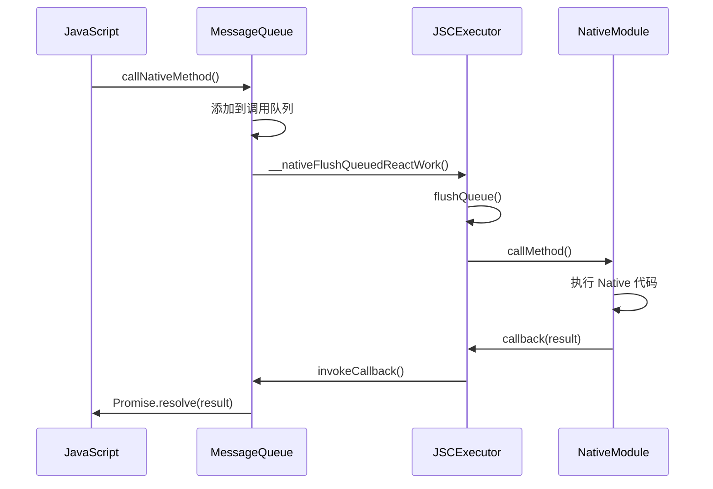
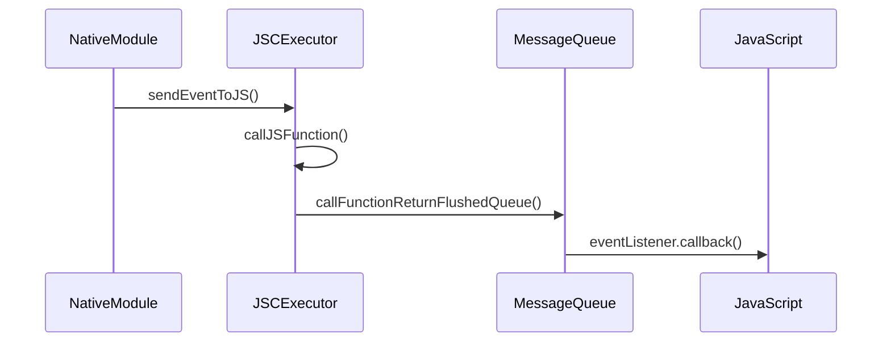

# React Native Bridge 架构详解

## 概述

本文档详细介绍了传统 React Native Bridge 的通信架构，帮助开发者深入理解 JavaScript 和 Native 代码之间的通信机制。

## 架构分层

```
┌─────────────────────────────────────┐
│           JavaScript Layer         │  ← React Native 应用层
│        (React Components)          │
├─────────────────────────────────────┤
│         JavaScript Bridge          │  ← 消息队列和模块代理
│        (MessageQueue)              │
├─────────────────────────────────────┤
│           C++ Bridge Layer         │  ← JavaScript 引擎和通信桥梁
│         (JSCExecutor)              │
├─────────────────────────────────────┤
│          Native Module Layer       │  ← 平台原生功能实现
│        (iOS/Android)               │
└─────────────────────────────────────┘
```

## 核心组件详解

### 1. JavaScript Layer (JavaScript 层)

#### MessageQueue.js
- **职责**: 管理 JS 和 Native 之间的消息队列
- **核心功能**:
  - 调用队列管理
  - 回调函数注册
  - 模块注册表维护
  - 消息序列化

```javascript
// 关键方法
callNativeMethod(moduleName, methodName, args, onSuccess, onFail)
flushedQueue()  // 被 Native 调用，获取待执行队列
invokeCallbackAndReturnFlushedQueue(callbackID, args)  // 执行 JS 回调
```

#### NativeModules.js
- **职责**: 提供 Native 模块的 JavaScript 代理
- **核心功能**:
  - 模块代理对象创建
  - Promise 化的异步调用接口
  - 模块注册和管理

#### Bridge.js
- **职责**: 高级 Bridge API 封装
- **核心功能**:
  - 事件系统
  - 双向通信通道
  - 错误处理

### 2. C++ Bridge Layer (C++ 桥接层)

#### JSCExecutor
- **职责**: JavaScript 引擎管理和执行
- **核心功能**:
  - JavaScript 代码执行
  - JS 和 C++ 数据转换
  - Native 函数注入
  - 异常处理

```cpp
// 关键方法
JSExecuteResult executeScript(const std::string& script, const std::string& sourceURL)
JSExecuteResult callJSFunction(const std::string& functionName, const std::string& arguments)
std::vector<NativeCall> flushQueue()
void registerNativeModule(int moduleId, const std::string& moduleName, std::shared_ptr<NativeModule> module)
```

#### NativeModule (基类)
- **职责**: 定义 Native 模块接口
- **核心功能**:
  - 模块方法描述
  - 常量定义
  - 方法调用分发

### 3. Native Module Layer (原生模块层)

#### iOS 实现
- 使用 Objective-C++ 混合编程
- 利用 iOS 系统 API
- 通过 NSNotificationCenter 实现事件监听

#### Android 实现
- 使用 JNI 调用 Java 代码
- 利用 Android 系统 API
- 通过 BroadcastReceiver 实现事件监听

## 通信流程详解

### JS → Native 调用流程



### Native → JS 事件推送流程



## 数据序列化

### JavaScript → Native
1. JavaScript 参数 → JSON 字符串
2. JSON 字符串 → C++ std::string
3. C++ 解析 JSON → Native 类型

### Native → JavaScript
1. Native 类型 → JSON 字符串
2. JSON 字符串 → JSValue
3. JSValue → JavaScript 对象

## 异步调用机制

### 回调 ID 管理
```javascript
// JavaScript 端
this._callbackCount = 1;
this._callbacks = [];

// 注册回调
this._callbacks[this._callbackCount] = {onSuccess, onFail};
args = args.concat([this._callbackCount, this._callbackCount]);
this._callbackCount++;
```

### Promise 化接口
```javascript
// 将回调转换为 Promise
moduleProxy[methodName] = (...args) => {
  return new Promise((resolve, reject) => {
    this._messageQueue.callNativeMethod(
      moduleName, methodName, args, resolve, reject
    );
  });
};
```

## 错误处理机制

### JavaScript 层错误处理
- Promise rejection
- 异常捕获和日志记录
- 回调错误参数

### C++ 层错误处理
- JavaScript 异常捕获
- 空指针检查
- 资源清理

### Native 层错误处理
- 系统 API 调用失败
- 权限检查
- 线程安全

## 性能优化策略

### 1. 批量调用
```javascript
// 批量执行多个 Native 调用
const promises = [
  DeviceInfo.getDeviceId(),
  DeviceInfo.getBatteryLevel(),
  DeviceInfo.getNetworkState()
];
const results = await Promise.all(promises);
```

### 2. 消息队列优化
- 合并同步调用
- 减少序列化开销
- 智能队列刷新

### 3. 内存管理
- 及时释放回调
- Native 对象生命周期管理
- 避免内存泄漏

## 调试技巧

### 1. 日志系统
```javascript
// JavaScript 日志
console.log('[Bridge] 调用 Native 方法:', moduleName, methodName);

// C++ 日志
std::cout << "[JSCExecutor] 执行脚本: " << sourceURL << std::endl;

// Native 日志 (iOS)
NSLog(@"[DeviceInfo] 获取设备 ID");

// Native 日志 (Android)
__android_log_print(ANDROID_LOG_INFO, "DeviceInfo", "获取设备 ID");
```

### 2. 调试工具
- Chrome DevTools (JavaScript 调试)
- Xcode Debugger (iOS 调试)
- Android Studio Debugger (Android 调试)
- Bridge 状态查询接口

### 3. 性能监控
```javascript
// 调用耗时监控
const startTime = Date.now();
const result = await NativeModule.method();
const duration = Date.now() - startTime;
console.log(`方法耗时: ${duration}ms`);
```

## 最佳实践

### 1. 模块设计
- 单一职责原则
- 合理的方法粒度
- 清晰的接口定义

### 2. 错误处理
- 统一的错误码定义
- 详细的错误信息
- 优雅降级机制

### 3. 性能考虑
- 避免频繁的 Bridge 调用
- 合理使用缓存
- 异步操作优先

### 4. 安全性
- 输入参数验证
- 权限检查
- 敏感数据保护

## 与新架构 (JSI) 的对比

| 特性 | 传统 Bridge | JSI |
|------|------------|-----|
| 通信方式 | 异步消息队列 | 同步直接调用 |
| 序列化 | JSON 序列化 | 直接对象传递 |
| 性能 | 相对较慢 | 更快 |
| 类型安全 | 运行时检查 | 编译时检查 |
| 调试难度 | 相对困难 | 更容易 |

## 总结

传统 React Native Bridge 虽然在性能上不如新的 JSI 架构，但其设计思想和实现方式仍然具有重要的学习价值。通过深入理解 Bridge 的工作原理，可以帮助开发者：

1. 更好地理解 React Native 的底层机制
2. 编写更高效的跨平台代码
3. 为迁移到新架构做好准备
4. 解决实际开发中遇到的问题

本演示项目提供了完整的实现示例，可以作为学习和实验的基础。
